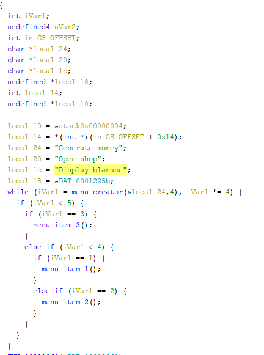
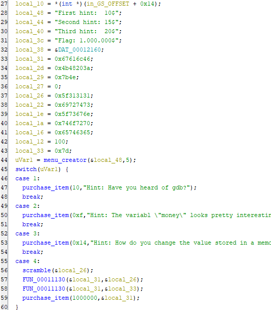
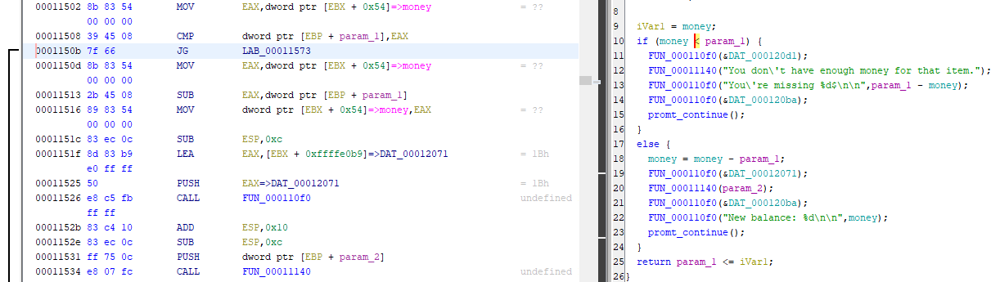
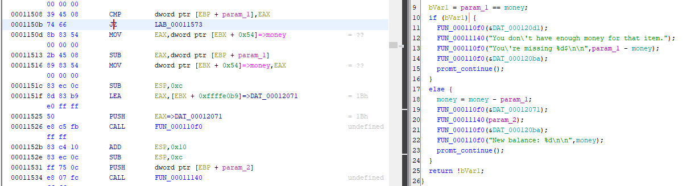
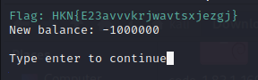

## Description

File: [money_printer](./money_printer)

## Start

Først finder vi den decompileret kode gennem ghidra. 

Dernæst ser vi hvad der var inde i menu item 2 som er der hvor vi kan købe flaget når programmet køres

Nu prøver vi at se hvordan koden til purchase item ser ud

Der er noget kondition på vores penge som ser om vi har nok til at kunne købe det ønsket produkt. Vi kan nu patche dette ved at bruge JZ i stedet

Nu exporterer vi og prøver at købe flaget.

Flaget er `HKN{E23avvvkrjwavtsxjezgj}`

