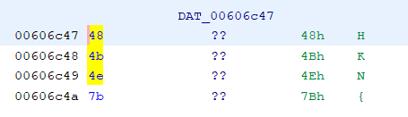
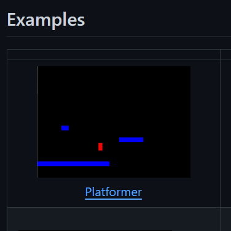
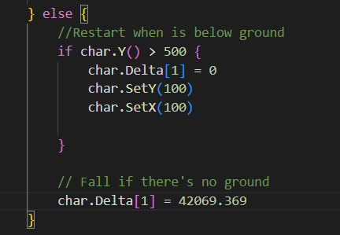
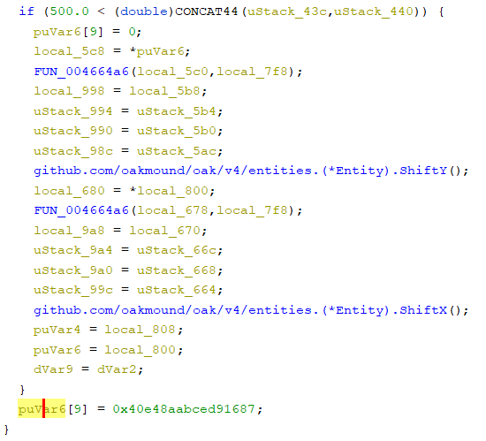
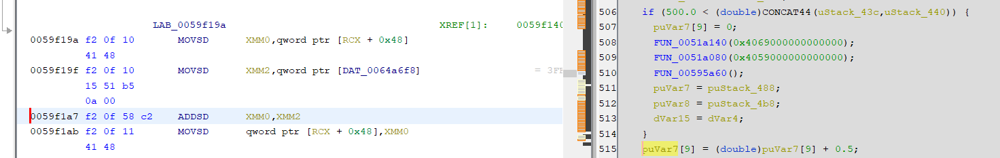
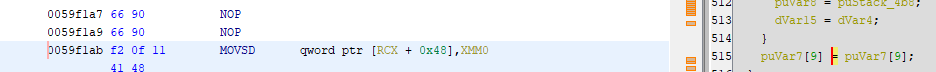
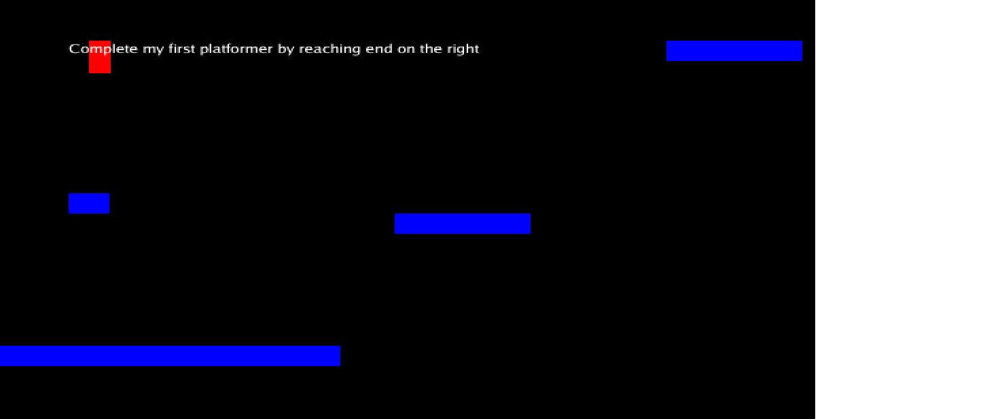
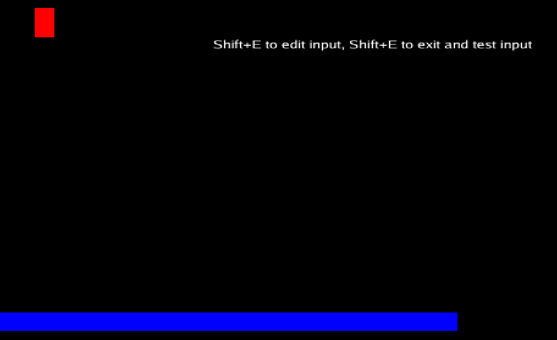
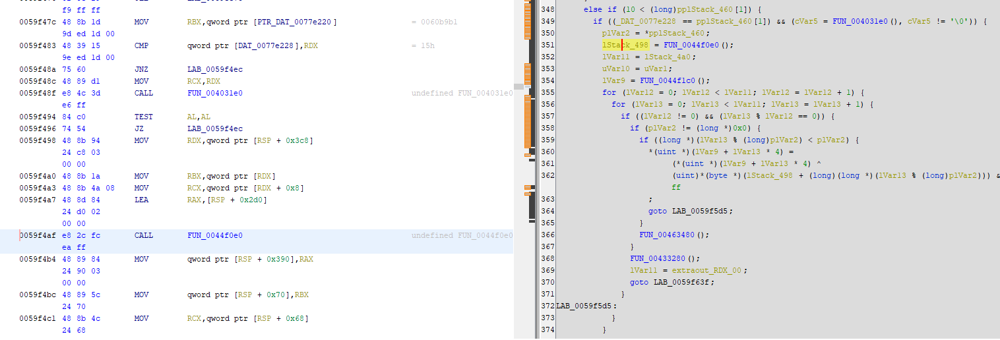
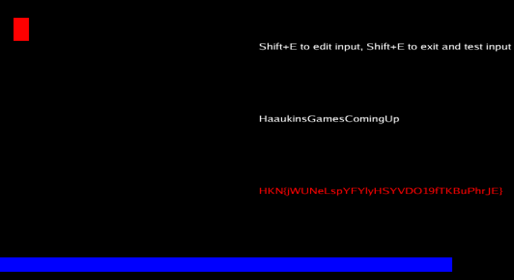

## Description

Welcome to the first game produced by Fumble Studio; they want you to be the tester of their new game, Patch Platformer.

Complete the game and be rewarded with a flag; get the game here:

File: [patch_platform](./patch_platform)

## Start

Til at starte med var målet at finde en main funktion. Jeg kiggede lidt rundt og søgte efter strings med f.eks. flagets prefix (HKN). 

Dette ledte hen til en main funktion (som jeg ikke vidste var main på dette tidspunkt). Så ledte jeg videre og fandt nogle github links som pegede på https://github.com/oakmound/oak.

Her gik jeg ned og fandt 

Som ligner rigtigt meget det spil vi arbejder med. Nu var ideen at finde main funktionen ved at først compilerer eksempel koden fra github siden og ændre i variabler til at cross reference main funktionen i den udleveret binary og samtidigt at finde ud af hvordan man slog tyngdekraften af så man kunne bevæge sig til højre.

## Go eksemplet

Først lavede jeg en ændring i eksemple kodet for at kunne finde main funktion i mine den kompileret go fil

Nu var ideen at finde dette i det udleveret binary, hvor at prefixet HKN{ også lå og patche gravity til 0 ved at NOP'e det ud.

Nu kan spillet spilles uden at have gravity.

## Finde flaget

Vi skulle nu gå til højre og få flaget

Her kan vi så se at det vi skal give noget input for at få et flag. Det jeg startede med var tilfældige ting, men indså at der kun gives status besked efter 11 karakter. Dvs. at vi skal finde 10 eller 11 i vores main funktion

Her tjekker den så om mit input er rigtigt og giver flaget. Der sker comparison på ordet `HaaukinsGamesComingUp` og inputtet og om inputtet har længden 21 hvilket `HaaukinsGamesComingUp` også har. 

Skriver man dette i spillet får man flaget

`HKN{jWUNeLspYFYlyHSYVDO19fTKBuPhrJE}`

